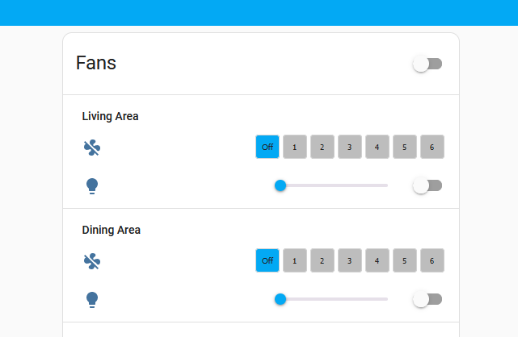

# Modern Forms Fan Button Row

This UI element for Home Assistant will provide a six speed button row compatible with Modern Forms fans.


##  Installation
Use HACS to intall this repo into your Home Assistant environment

## Usage
Below is an example YAML config that uses this custom component
```
  - type: entities
    entities:
      - type: section
        label: Living Area
      - entity: fan.lanai_living_area_fan_fan
        name: ' '
        type: custom:modern-forms-fan-button-row
      - entity: light.lanai_living_area_fan_light
        name: ' '
        toggle: true
        type: custom:slider-entity-row
      - type: section
        label: Dining Area
      - entity: fan.lanai_dining_area_fan_fan
        name: ' '
        type: custom:modern-forms-fan-button-row
      - entity: light.lanai_dining_area_fan_light
        name: ' '
        toggle: true
        type: custom:slider-entity-row
```
